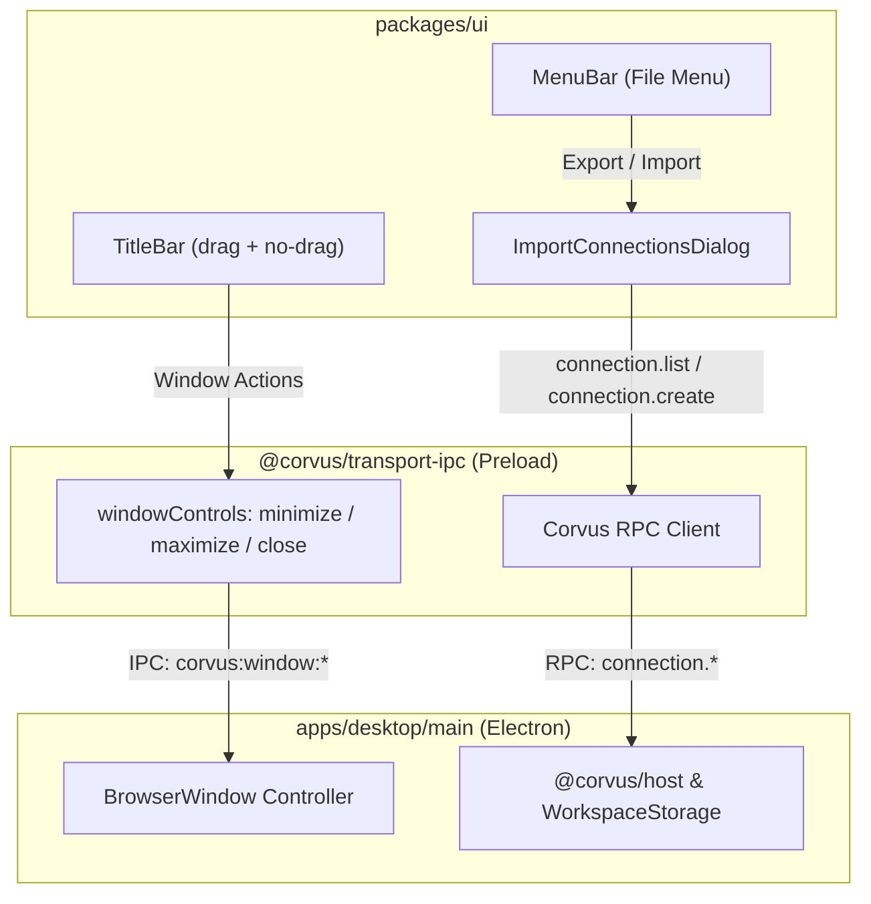

# Thiết kế Kỹ thuật: Điều khiển Cửa sổ Desktop & Import/Export Connections

**Tài liệu tham chiếu**: `docs/superpowers/specs/2026-08-22-desktop-window-and-connections-import-export-design.md`  
**Nhánh Git**: `002-docker-real-env-testing`  
**Ngày tạo**: 2026-08-22

---

## 1. Mục tiêu & Phạm vi

1. **TitleBar kéo thả (Window Dragging)**:
   - Cho phép người dùng nhấn giữ và kéo thả vùng trống trên thanh tiêu đề `TitleBar` để di chuyển cửa sổ Desktop.
   - Các thành phần tương tác (nút điều khiển, chuyển theme, ngôn ngữ, avatar) không bị chặn click nhờ cấu hình `no-drag`.

2. **Bộ nút điều khiển cửa sổ Desktop (Minimize, Maximize/Restore, Close)**:
   - Kết nối bộ 3 nút trên `TitleBar` với tiến trình Electron Main thông qua IPC bridge an toàn (`@corvus/transport-ipc`).
   - Tự động ẩn/vô hiệu hoá một cách hợp lý khi chạy ở chế độ Web.

3. **Tính năng Xuất / Nhập Cấu hình Kết nối (Connection Import / Export)**:
   - Bổ sung 2 mục vào menu `File`: **Xuất danh sách kết nối… (Export connections…)** và **Nhập danh sách kết nối… (Import connections…)**.
   - Hộp thoại `ImportConnectionsDialog` trực quan: xem trước danh sách kết nối từ tệp JSON, tick chọn kết nối cần nạp, xử lý trùng tên (ghi đè, bỏ qua, hoặc tự thêm hậu tố).
   - Lưu trữ và mã hoá mật khẩu theo chuẩn Vault sẵn có trong `@corvus/storage`.

4. **Tệp cấu hình kết nối mẫu Docker Dev Stack**:
   - Tạo tệp `docker-dev-connections.json` chứa cấu hình sẵn có của 7 container database + 1 SQLite sample để người dùng có thể import và kết nối ngay lập tức.

---

## 2. Kiến trúc & Thiết kế Chi tiết



### 2.1. TitleBar & Window Controls IPC

1. **Giao thức IPC (`@corvus/transport-ipc/preload`)**:
   - Mở rộng giao diện `window.corvus`:
     ```ts
     export interface WindowControlsApi {
       minimize: () => void
       maximize: () => void
       close: () => void
       isMaximized: () => Promise<boolean>
     }
     ```
2. **Xử lý tại Electron Main (`apps/desktop/main`)**:
   - Lắng nghe các kênh IPC:
     - `corvus:window:minimize`: `win.minimize()`
     - `corvus:window:maximize`: `win.isMaximized() ? win.unmaximize() : win.maximize()`
     - `corvus:window:close`: `win.close()`
     - `corvus:window:isMaximized`: trả về `win.isMaximized()`
3. **Giao diện `TitleBar.tsx` (`packages/ui`)**:
   - Container bao ngoài: `WebkitAppRegion: 'drag'`.
   - Các nút tương tác bên trong: `WebkitAppRegion: 'no-drag'`.
   - 3 nút Minimize, Maximize, Close:
     - Gọi `window.corvus?.windowControls` khi có trong môi trường Desktop.
     - Ẩn cụm nút trên môi trường Web browser.

---

### 2.2. Import / Export Connections

1. **Định dạng tệp Backup JSON (`corvus-connections.json`)**:
   ```json
   {
     "$schema": "https://corvus-db.org/schema/v1/connections.json",
     "version": 1,
     "exportedAt": "2026-08-22T07:15:00.000Z",
     "connections": [
       {
         "name": "PostgreSQL Dev",
         "driverId": "postgres",
         "host": "127.0.0.1",
         "port": 5432,
         "database": "corvus_dev",
         "user": "corvus_dev",
         "password": "corvus_dev",
         "color": "#336791"
       }
     ]
   }
   ```

2. **Quy trình Export**:
   - Người dùng chọn `File -> Xuất danh sách kết nối…`.
   - Gửi yêu cầu `connection.list` lấy danh sách cấu hình.
   - Tạo Blob JSON và kích hoạt tải xuống tệp `corvus-connections-backup-YYYY-MM-DD.json`.

3. **Quy trình Import & Hộp thoại `ImportConnectionsDialog`**:
   - Người dùng chọn `File -> Nhập danh sách kết nối…` và chọn file JSON.
   - Ứng dụng đọc file, kiểm tra tính hợp lệ của schema.
   - Hiển thị hộp thoại `ImportConnectionsDialog`:
     - Danh sách từng kết nối (Tên, Loại DB + Icon, Host:Port, Database, User) kèm checkbox (mặc định chọn tất cả).
     - Lựa chọn giải quyết trùng tên:
       - **Ghi đè (Overwrite)**: Cập nhật kết nối cũ.
       - **Tạo bản sao (Rename duplicate)**: Thêm hậu tố `(1)`, `(2)`.
       - **Bỏ qua (Skip)**: Giữ nguyên kết nối hiện tại.
     - Bấm **Nhập kết nối**: Thực hiện gọi `connection.create` / `connection.update` qua RPC.
     - Cập nhật lại danh sách kết nối trên giao diện và hiển thị thông báo thành công.

---

### 2.3. Tệp cấu hình Docker Dev Stack (`docker-dev-connections.json`)

Bao gồm cấu hình cho toàn bộ 8 hệ cơ sở dữ liệu:
1. **PostgreSQL**: `127.0.0.1:5432`, user: `corvus_dev`, pass: `corvus_dev`, db: `corvus_dev`
2. **MySQL**: `127.0.0.1:3306`, user: `corvus_dev`, pass: `corvus_dev`, db: `corvus_dev`
3. **MariaDB**: `127.0.0.1:3307`, user: `corvus_dev`, pass: `corvus_dev`, db: `corvus_dev`
4. **SQL Server**: `127.0.0.1:1434`, user: `sa`, pass: `Corvus_Dev_2026!`, db: `corvus_dev`
5. **Oracle 23 Free**: `127.0.0.1:1521`, user: `CORVUS_DEV`, pass: `corvus_dev`, db: `FREEPDB1`
6. **MongoDB**: `127.0.0.1:27017`, user: `corvus`, pass: `corvus_dev`, db: `corvus_dev`
7. **Redis**: `127.0.0.1:6379`, pass: `corvus_dev`
8. **SQLite**: tệp `.corvus-data/sample.sqlite`

---

## 3. Kế hoạch Kiểm thử & Xác minh

1. **Kiểm thử Kéo thả & Điều khiển Cửa sổ**:
   - Kéo chuột trên thanh TitleBar -> Cửa sổ di chuyển mượt mà trên desktop.
   - Nhấn nút Minimize -> Cửa sổ thu nhỏ xuống taskbar.
   - Nhấn nút Maximize -> Cửa sổ phóng to toàn màn hình; bấm lần nữa -> khôi phục kích thước cũ.
   - Nhấn nút Close -> Đóng cửa sổ ứng dụng sạch sẽ.
2. **Kiểm thử Import / Export Connections**:
   - Export danh sách kết nối hiện có ra file JSON.
   - Import file `docker-dev-connections.json` vào ứng dụng:
     - Kiểm tra hiển thị bảng preview trong hộp thoại.
     - Nhấn Import -> 8 kết nối xuất hiện trên cây điều hướng `NavTree` và trang `WelcomeView`.
     - Nhấp đúp vào kết nối -> Kết nối thành công đến Docker container.
3. **Chạy bộ kiểm thử tự động**:
   - Chạy `pnpm verify` đảm bảo 100% lint, typecheck, tests, contract và build đều xanh.